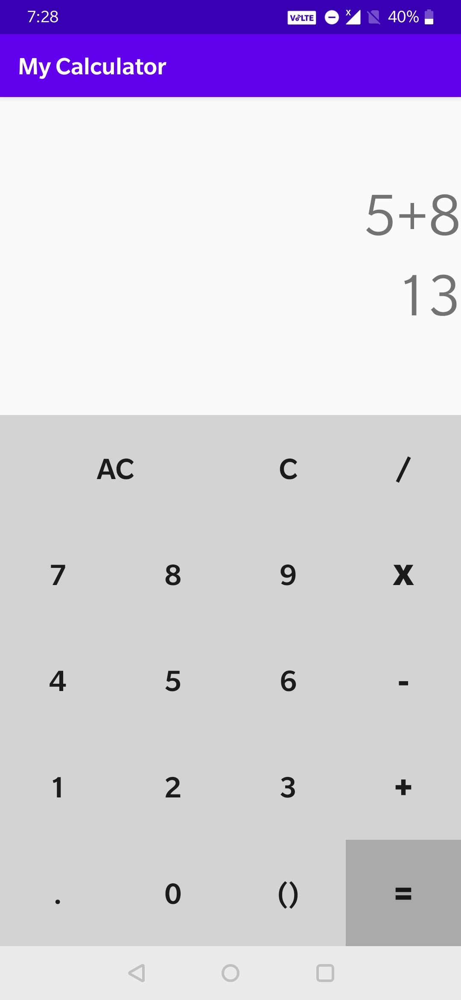
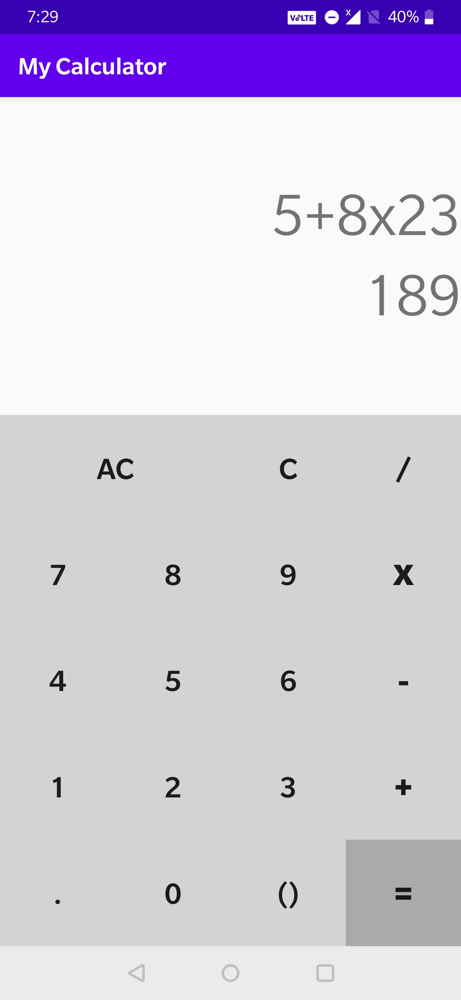
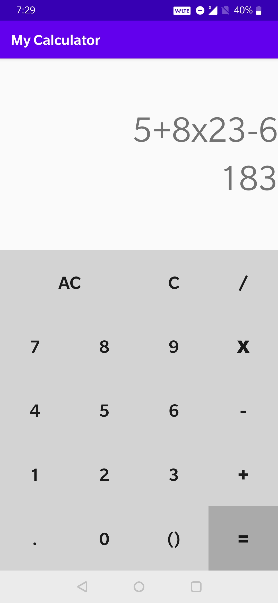
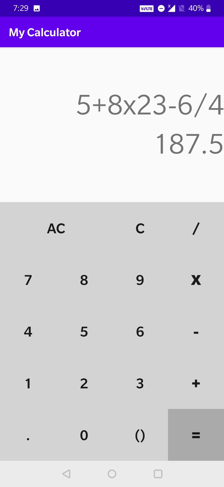
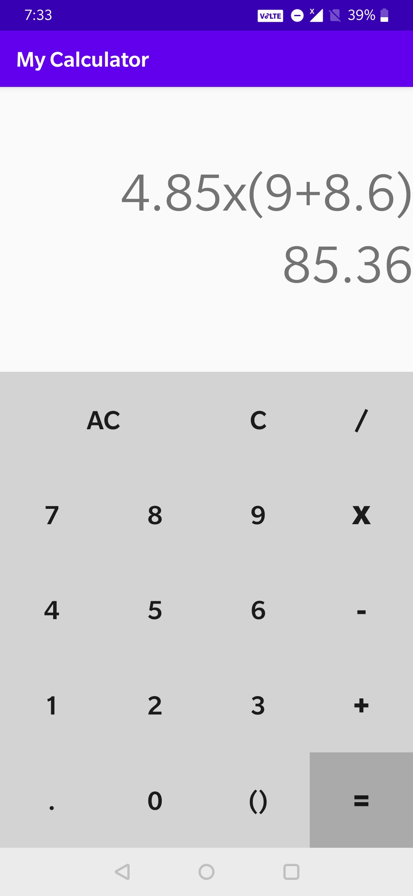

## Android Application for a Calculator with basic operations and dynamic expression evaluation

#### Layout

#### Basic Operations with dynamic result display

&nbsp;&nbsp;&nbsp;&nbsp;&nbsp;&nbsp;&nbsp;&nbsp;&nbsp;&nbsp;&nbsp;&nbsp;

    

#### Handling Brackets

